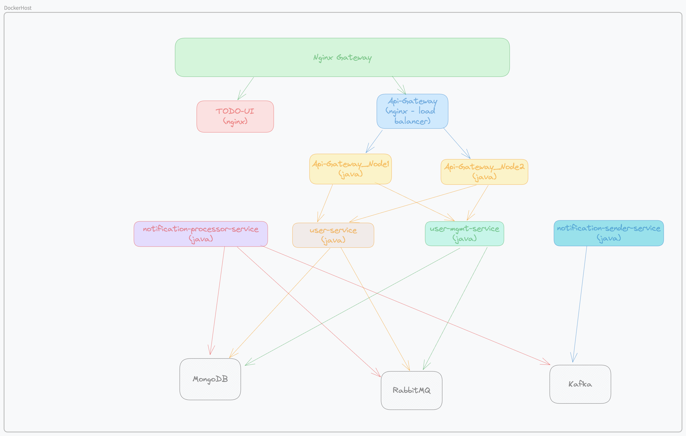
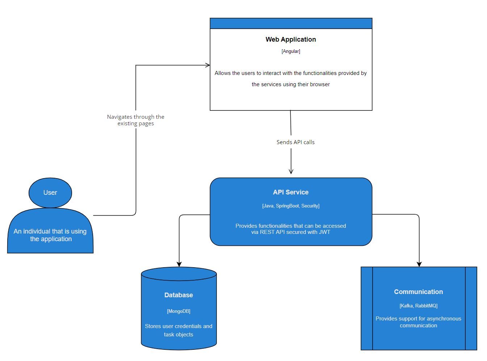
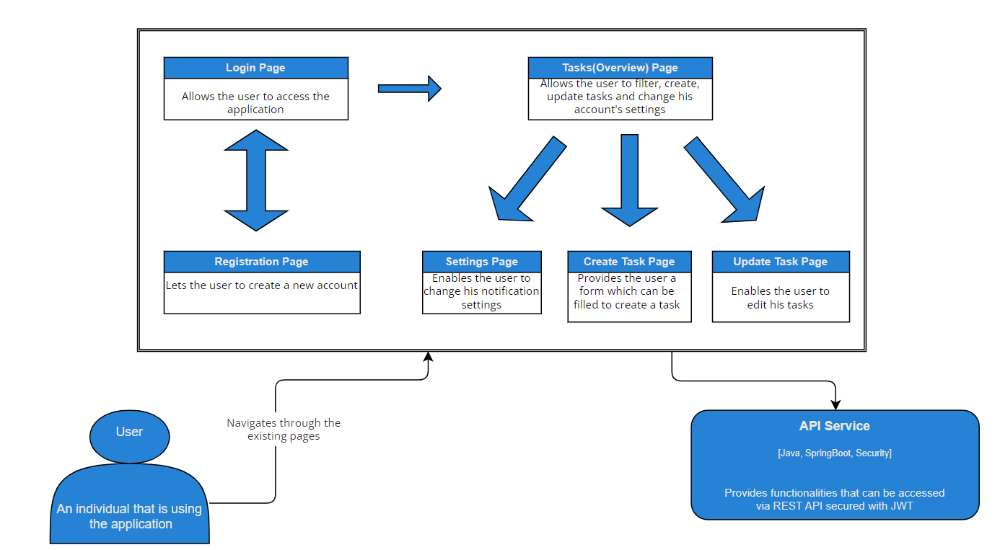
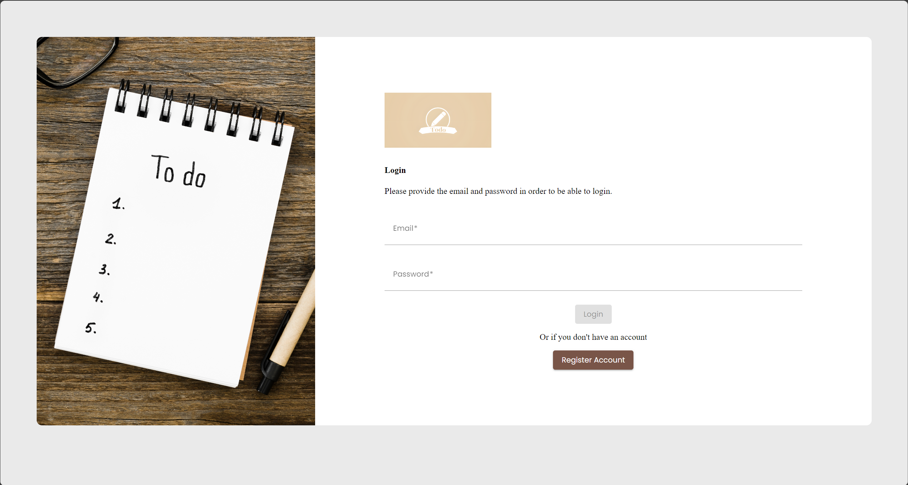
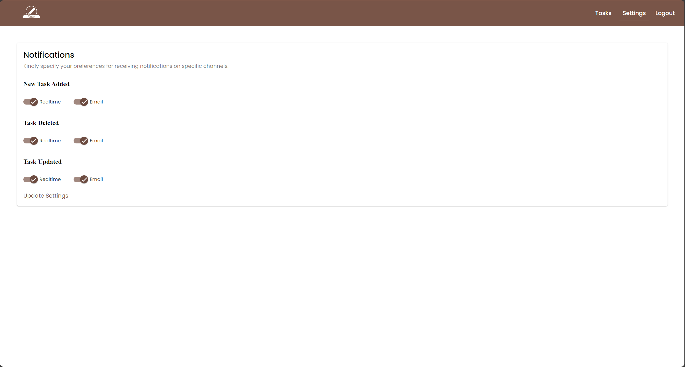
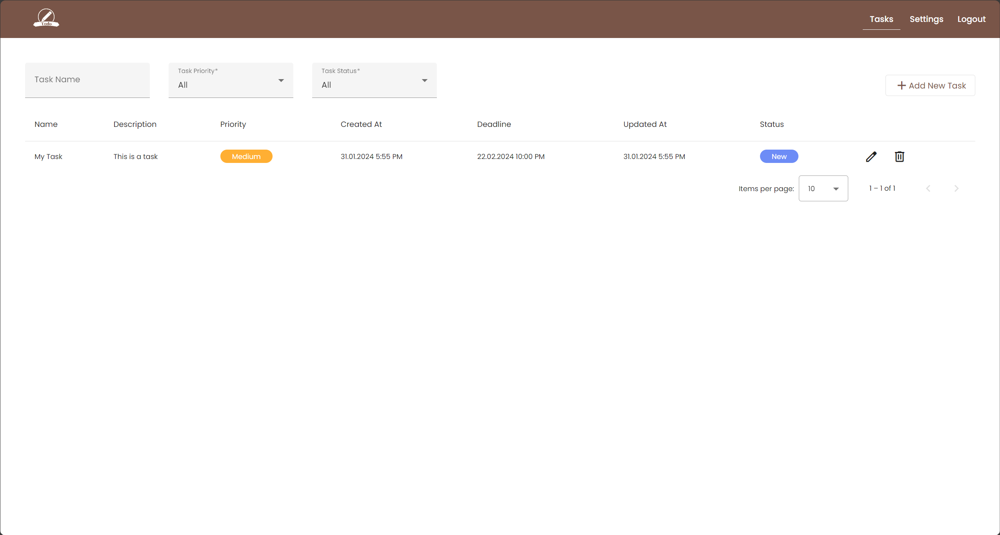
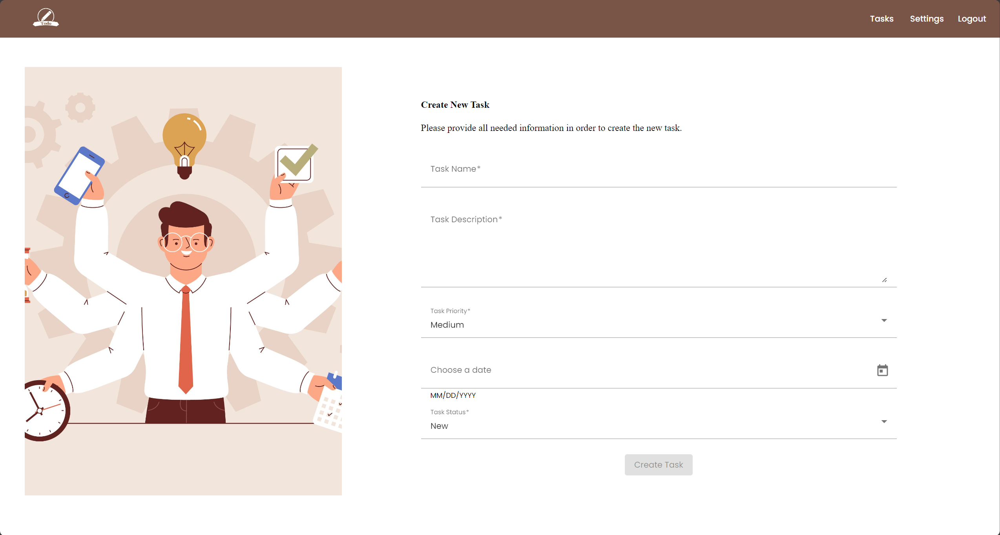

# Software System

## Software requirements
1) For development:
   1) java 21
   2) docker

## Components
1) user-service
   ### Features
   1) Create new account
   2) Login
   3) Logout
   4) Add user settings
   5) Get user settings
2) task-mgmt-service
   ### Features
    1) Create new task
    2) Get task by id
    3) Delete task by id
    4) Update task by id
    5) Filter tasks
3) notification-processor-service
   ### Features
   1) Will listen on /notifications exchange and check if a notification should be sent or not. The logic depends on User Settings.
4) notification-server-service
   ### Features
   1) Will listen on **/notifications/email** and **/notifications/realtime** topics and send the notification on the particular channel.

## Component diagram


## Run application
1) Every application can be started individually. Please check the env variables that should be configured by taking checking the _deployment/docker-compose.yaml_ file.
2) In order to run the entire application (**FE + BE**) in docker:
   ```shell
      cd deployment
      ./start-services.sh
    ```
    Application is accessible on: http://localhost:8080   
    Swagger will be accessible on: http://localhost:8080/api/swagger-ui.html (definition for both microservices can be selected from the upper right)


# Overview
Task management app is an application based on microservices which helps its users to create, update and delete tasks. 

Due to its design and appearence, it enables the users to do a quick registration, login, and then to proceed with the creation of their desired tasks.

Also, it provides a notification system that sends an email (if enabled) for each action that was registered to the app: create task, update and delete.

# Architecture

The application consists of four main components, as shown in the following figure:



<ul>
   <li><strong>Web Application</strong> - provides the users the ability to interact with the system. They can authenticate and navigate through the pages and perform actions that will be forwarded to the <strong>API Service</strong></li>
   <li><strong>API Service</strong> - represents the component that processes the requests received from the web application, providing, in return, a response</li>
   <li><strong>Database</strong> - used by the API to store all the data</li>
   <li><strong>Communication Systen</strong> - used by the API Service to allow asynchronous communication internally</li>
</ul>

# Front-end

The web application was built using <strong>Angular</strong> framework and <strong>SCSS</strong> for styling the components within the pages.

The pages that the user can interact with are:
<ul>
   <li><strong>Login page</strong></li>
   <ul>
      <li>greets the user when landing on the domain</li>
      <li>provides direct access to authentication and redirection to registration</li>
   </ul>
   <li><strong>Registration page</strong></li>
   <ul>
      <li>provides to the user the sign-up form</li>
      <li>allows to navigate to login page</li>
   </ul>
   <li><strong>Tasks page</strong></li>
   <ul>
      <li>enables the user to create a new task</li>
      <li>provides filtering methods by name, priority and status</li>
   </ul>
   <li><strong>Create new task page</strong></li>
   <ul>
      <li>enables the user to fill a form in order to add a new task by setting its title, description, priority, date and status</li>
   </ul>
   <li><strong>Update task page</strong></li>
   <ul>
      <li>enables the user to edit a task previously created in order to update its status, priority, date, title or description</li>
   </ul>
    <li><strong>Settings page</strong></li>
   <ul>
      <li>provides the user a method to enable or disable notifications for addition, update or deletion of a task</li>
   </ul>
</ul>



# Back-end

The API Service is developed in Java making use of the Spring framework, incorporating some of the vital Spring components:
 <ul>
   <li><strong>Spring Boot</strong> includes an embedded web server that simplifies dependency management and building production-ready applications</li>
   <li><strong>Spring Security</strong> is used for authentication using JSON Web Tokens</li>
 </ul>


### Apache Kafka
Apache Kafka is an event streaming platform that is used for messaging where, this time, it is crucial to persist the data sent. Kafka persists messages to disk, ensuring that messages are not lost even if a microservice goes down or it is temporarily unavailable; when it comes back online, the microservice can catch up on the missed messages and resume processing them.

In this example, Kafka is used for processing and sending mail services. When a user creates a new task, the services will process the event and will send a mail to inform him that a new task was added using Simple Mail Transfer Protocol (SMTP).

### RabbitMQ
RabbitMQ is an open-source message-broker software (sometimes called message-oriented middleware) that originally implemented the Advanced Message Queuing Protocol (AMQP) and has since been extended with a plug-in architecture to support Streaming Text Oriented Messaging Protocol (STOMP), MQ Telemetry Transport (MQTT), and other protocols.

### Inside a microservice
Each microservice is following the <strong>Controller-Service-Repository</strong> pattern which is a common
<ul>
<li>The <strong>Controller</strong> contains the endpoints and it is responsible for receiving user requests and delegates tasks to the appropriate Service for processing.</li>

<li>The <strong>Service</strong> contains the business logic and orchestrates the execution of tasks - it uses the Repository to interact with the data store for persistence and retrieval of data.</li>

<li>The <strong>Repository</strong> abstracts the data access logic, in our case an external database and provides a clean and standardized interface for the Service to interact with the underlying data store.</li>
</ul>

Each microservice includes a <strong>Security Component</strong> that intercepts requests before they reach the controller. If the request passes through the security chain filters successfully, it will be redirected back to the controller. The primary objective is to validate the JSON Web Token located in the request header of a logged user. The validation involves verifying the signature and checking the expiration date by using a specialized <strong>JWT Service</strong>.

# Functionalities and endpoints

### Authentication Controller

<ul>
   <li><code>POST /auth/sign-in</code> registers a new user</li>
   <li><code>POST /auth/login</code> logs in a user and returns a JWT, included in the header of future calls</li>
   <li><code>POST /auth/logout</code> logs out the user</li>
</ul>




### User Settings Controller

<ul>
   <li><code>GET /user-settings</code> retrieves user's current settings</li>
   <li><code>PUT /user-settings</code> updates user's settings</li>
</ul>



### Task Controller

<ul>
   <li><code>GET /tasks/{id}</code> retrieves the details of a task</li>
   <li><code>PUT /tasks/{id}</code> use to update a task</li>
   <li><code>DELETE /tasks/{id}</code> use to delete a task</li>
   <li><code>GET /tasks</code> retrieves the list of tasks</li>
   <li><code>POST /tasks</code> creates a new task</li>
</ul>


